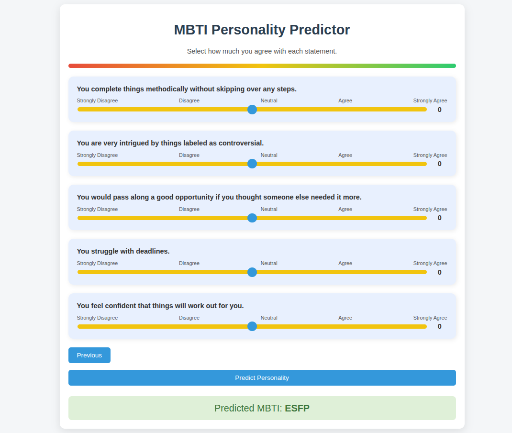
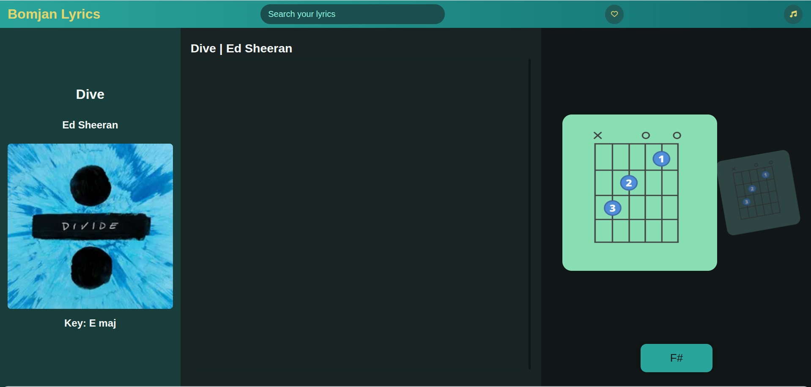

# Hey there, I'm Sundra Bomjan

I'm a 1st-year Computer Science student at Gyalpoizhing College of Information Technology (GCIT), School of Computing.  
I enjoy web development, creative coding, and I'm exploring Machine Learning and Wireshark on my own.

---

## Skills & Current Focus

Here's what I'm working with and learning day by day:

---

## Projects I've Built / Working On

### 16 Personalities (ML)

  <!-- 16 Personalities Card -->
  

    
    

      <h3 style="margin:0 0 10px 0;">16 Personalities (ML)</h3>
      
A Machine Learning model that predicts personality types. Built using FastAPI.

      <a href="https://github.com/Bomjan/MachineLearning/tree/main/16Personalities" target="_blank" style="text-decoration:none; color:#ff7f50; font-weight:bold;">Check it out →</a>
    

  

  <!-- Lyric App Card -->
  

    
    

      <h3 style="margin:0 0 10px 0;">Lyric App</h3>
      
Personal lyrics and chords manager app for practicing and keeping music organized.

      <a href="https://github.com/Bomjan/Lyric" target="_blank" style="text-decoration:none; color:#ff7f50; font-weight:bold;">Check it out →</a>
    

  

  <!-- Dzongkha Keyboard Game Card -->
  

    
    

      <h3 style="margin:0 0 10px 0;">Dzongkha Keyboard Game</h3>
      
A fun typing game project built with an amazing team (Somzam, Shelkar).

      <a href="https://github.com/Bomjan/FEWD/tree/main/assignments/groupwork" target="_blank" style="text-decoration:none; color:#ff7f50; font-weight:bold;">Check it out →</a>
    

  

---

## GitHub Stats

Here’s a snapshot of my GitHub activity:

---

## How to Reach Me

|                                                        |                                                   |
| ------------------------------------------------------ | ------------------------------------------------- |
| [LinkedIn](https://linkedin.com/in/sundrabomjan)       | [TikTok](https://www.tiktok.com/@__s_u_n_d_r_a__) |
| [Twitter](https://twitter.com/sundrabomjan)            | [Instagram](https://www.instagram.com/suboypeace) |
| [Facebook](https://www.facebook.com/share/1FaqS5SS9M/) | [WhatsApp](https://wa.me/17557031)                |
| [Threads](https://www.threads.net/@suboypeace)         | [Email](mailto:sundrabomjan@gmail.com)            |

---

## Fun Fact

I love mixing creativity with coding to make interactive and fun web experiences.  
Sometimes I spend hours experimenting with animations, visuals, and small projects—it’s how I learn best.

---

### GitHub Contribution Snake

---

